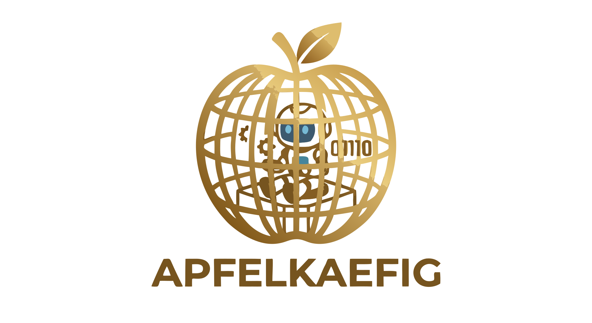

<p align="center">
  
</p>

# apfelkäfig

Disposable dev sandboxes on Apple Silicon, safe to point coding agents at.

`akf up` boots a project inside an Apple-`container` micro-VM with Claude Code (or any CLI agent)
running with `--dangerously-skip-permissions`. **The VM is the sandbox**, so the permission prompts
are redundant, not risky.

Status: pre-release (v0.2). macOS / Apple Silicon only.

## Install

From source (Deno 1.41+):

```bash
git clone https://github.com/ApfelKaefig/apfelkaefig
cd apfelkaefig
deno task compile
cp dist/akf /usr/local/bin/akf
```

Homebrew and npm are planned — see [`TODO.md`](TODO.md).

## Use

The drive-by path needs no project setup at all. From any directory:

```bash
akf up                         # interactive Claude inside the built-in image
akf up bash                    # drop into a shell
akf up -- claude --resume      # forward args to the in-container command
akf clean                      # leave no trace
```

For projects you'll come back to, commit a `.apfelkaefig.json`:

```bash
cd ~/code/my-project
akf init                       # writes .apfelkaefig.json + marker blocks
akf up
```

## Three project tiers

apfelkäfig recognizes three shapes — pick the lightest one that fits, promote when you outgrow it.

1. **drive-by** — no files in the repo. `akf up` works from any directory using built-in defaults
   plus CLI flags. Leaves no trace; `akf clean` removes the container when you're done.
2. **akf-native** — `.apfelkaefig.json` at the repo root. Versioned, JSONC,
   [published schema](https://apfelkaefig.com/schema/v1.json) for IDE autocomplete. Advertises akf
   usage to collaborators.
3. **devcontainer-native** — `.devcontainer/devcontainer.json` at the repo root. Plays with VS Code
   Dev Containers, GitHub Codespaces, Coder. More capable than tier 2; reach for it when you need
   the dev-container ecosystem.

`akf init` defaults to tier 2. `akf init --advanced` writes tier 3. `akf eject --devcontainer`
promotes tier 2 → tier 3; `akf eject --bash` writes self-contained `start.sh` + `build.sh` that boot
the same sandbox without akf. Eject is one-way — to come back, ask Claude to read the ejected files
and rewrite a `.apfelkaefig.json`.

## Config

```jsonc
// .apfelkaefig.json
{
  "$schema": "https://apfelkaefig.com/schema/v1.json",
  "version": 1,

  // Defaults to ghcr.io/apfelkaefig/base. Set a registry tag, or build locally:
  // "image": { "dockerfile": ".devcontainer/Dockerfile" },

  "env": { "TZ": "UTC" },
  "command": ["claude", "--dangerously-skip-permissions"]
}
```

JSONC: comments and trailing commas allowed. Unknown top-level keys are a hard error — promote to
`.devcontainer/devcontainer.json` (tier 3) when you outgrow the schema.

The no-CLI manual setup lives in [`SKILL.md`](SKILL.md) — a Claude Code skill that drops the same
scaffold by hand.

## Requirements

- macOS on Apple Silicon
- [Apple `container`](https://github.com/apple/container) v0.9 or newer
- Docker — only when a project ships a custom `Dockerfile` (Apple `container`'s builder has DNS bugs
  in v0.9). Drive-by mode does not need Docker.

`akf doctor` checks all of the above; it only complains about Docker / 1Password when the active
config actually requires them.

## Why

Coding agents stop every few turns to ask permission for Bash commands, file writes, and WebFetch
domains. `--dangerously-skip-permissions` is only safe when the agent runs inside a VM whose only
writable mounts are the workspace and `~/.claude` — which is what apfelkäfig sets up.

See [`docs/notes/positioning.md`](docs/notes/positioning.md) for the competitive landscape and
[`docs/notes/architecture.md`](docs/notes/architecture.md) for design notes.

## Security model

The VM is the trust boundary. Inside it, Claude runs with every permission prompt disabled — that's
the point. Understand exactly what the VM can reach before letting an agent loose in it.

**The agent inside the sandbox can:**

- Read and write everything in the project folder (mounted at `/workspaces/<basename>`).
- Read and write your **entire `~/.claude` directory** — memories, MCP configs, login tokens, other
  projects' settings. This is a deliberate trade-off (so the agent shares your login and MCP setup
  with the host) but it means "sandboxed" does **not** mean "isolated from your Claude account."
  Drop the `~/.claude` mount via custom config if that bothers you.
- Reach the public internet on any port.

**The agent cannot:**

- Touch anything else on your host — other project folders, your home directory, shell history.
- Write to `~/Downloads` or `~/Desktop` (read-only mounts).

Sandboxing limits local blast radius, not network egress — anything the agent can read it can also
send out.

### Secrets

The base image ships with the 1Password CLI (`op`); `akf up` injects `OP_SERVICE_ACCOUNT_TOKEN` from
your env or macOS keychain so secrets can be resolved on demand with `op read`. See
[`docs/secrets.md`](docs/secrets.md) for the full pattern and threat model.

Found a security issue? Open a GitHub issue or email the address in `git log`.

## Develop

```bash
deno task test       # unit tests for config, container, secrets, fs
deno task dev up     # run from source
deno task compile    # build ./dist/akf
deno task fmt        # format
deno task lint       # lint
```

## License

MIT
